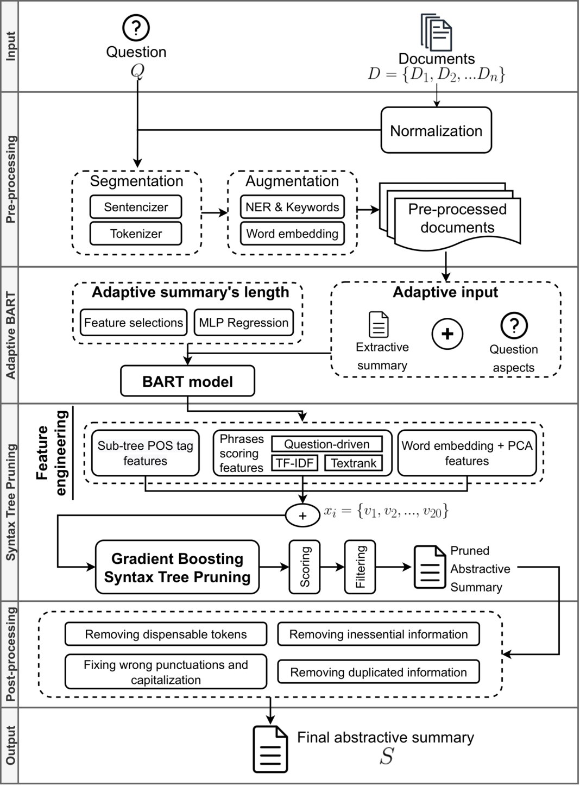

# Improving Biomedical Multi-document Abstractive Summarization

## Overview
This repository contains implementations and data of my Graduation Thesis named **Improving Biomedical Multi-document Abstractive Summarization with Syntax Tree Pruning and Generative Pre-Training Adaptation**. The proposed abstractive summarization model shown in the following Figure, includes four components, which are:
* Pre-processing
* Adaptive BART
* Syntax Tree Pruning
* Post-processing

## Structure of the Repository
The structure of the repository is presented as:
* `data`: datasets, export results of above-mentioned components.
* `run_scripts`: useful scripts for evaluation, training, testing, statisticizing and visualizing.
* `extractive_summarization`: simple implementations based on [our previous work](https://aclanthology.org/2021.bionlp-1.36/) of the extractive summarization model.
* `bart` and `pegasus`: implementations of the Adaptive BART and PEGASUS models.
* `syntax_tree_pruning`: implementations of the Syntax Tree Pruning.
* `utils`: utilities including pre-processing, post-processing, data loader and evaluation metrics.
## Dependencies requirements
Besides the dependencies listed in the `requirements.txt`, there are some other requirements, which are:
* [Stanford CoreNLP](https://stanfordnlp.github.io/CoreNLP) as Java package for syntax tree parsing
* [`facebook/bart_large_cnn`](https://huggingface.co/facebook/bart-large-cnn) and [`google/pegasus_large`](https://huggingface.co/google/pegasus-large) pre-trained models for abstractive summarization, retrieved from [HuggingFace](https://huggingface.co)
* [`dmis-lab/biobert-v1.1`] pre-trained models for BioBERT embeddings, retrieved from [HuggingFace](https://huggingface.co)
* `en_core_web_lg` and `en_core_sci_lg` (downloaded from [SciSpaCy](https://allenai.github.io/scispacy/)) for SpaCy pipelines.

## Results
Evaluation metrics:
* `ROUGE`: compare the **exact-matched** similarity between two documents.
* `BERTScore`: compare the **semantic-based** similarity between two documents.

Some main results are exported in `data`, in detail:
* `Bart/Test_Bart.txt` is the Adaptive BART's result.
* `SyntaxTreePruning/Test_Pruning_Heuristic.txt` is the Heuristical Syntax Tree Pruning result.
* `SyntaxTreePruning/Test_Pruning_Statistic.txt` is the Statistical Syntax Tree Pruning result.
* `SyntaxTreePruning/Test_Pruning_GB.txt` is the Gradient Boosting Syntax Tree Pruning result.
* `SyntaxTreePruning/Test_Pruning_GB_BART.txt` is the Adaptive BART + Gradient Boosting Syntax Tree Pruning result.
* `SyntaxTreePruning/Test_Pruning_GB_BART_Post.txt` is the Adaptive BART + Gradient Boosting Syntax Tree Pruning + Post-processing result.

## Author
**Quoc-Hung Duong**, Faculty of Information Technology, University of Engineering and Technology - VNU
